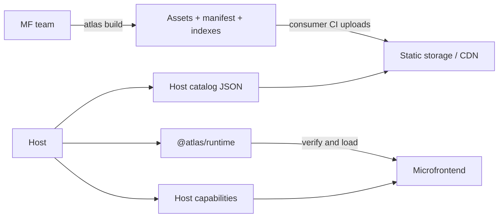

# Atlas

[](LICENSE)

Atlas is a TypeScript-first platform for independently built and deployed
microfrontends. A stable host owns the page, routing, authentication, layout,
and shared UI services. Feature teams deploy microfrontends without rebuilding
that host.

Atlas supports Angular and React hosts, microfrontends, and exported widgets.
An Angular host can load React MFs and a React host can load Angular MFs. Vue is
a future target and is not currently supported.

## What Atlas Provides

- Interactive generators for hosts, MFs, and exported widgets.
- Dynamic discovery through static JSON catalogs, with no registry service.
- Native Federation hidden behind framework adapters and generated wiring.
- One selected runtime version per MF, plus PR and historical versions.
- Local development inside the real host instead of a standalone MF shell.
- Typed host capabilities for users, HTTP clients, events, navigation, overlays,
  configuration, and host-specific data.
- Host-owned top-level routing with native Angular Router or React Router inside
  each MF.
- SHA-256 verification and origin restrictions for remotely executed assets.
- Provider-neutral output for Nginx, S3, Artifactory, Azure, or another CDN.

## The Mental Model



The **host** is the application shell. It owns the browser document, session,
top-level routes, slots, and visual providers such as modals and toasts.

A **microfrontend (MF)** owns a feature. It is mounted by a host and is not a
standalone product application.

A **manifest** describes one built MF version, including its immutable asset
URL, integrity hash, framework, host compatibility, routes, slots, and widgets.

A **catalog** selects exactly one version of every MF needed by one host. It is
ordinary JSON served from the consumer's static storage.

## Quick Start

Requirements: Node.js `^20.19.0`, `^22.12.0`, or `>=24.0.0`, plus npm,
pnpm, or Yarn. These ranges match the generated Vite 7 and Angular toolchains.

```sh
# Choose one:
npm install --global @atlas/cli
pnpm add --global @atlas/cli
yarn global add @atlas/cli

atlas g host customer-shell --framework=react
atlas g app orders --framework=angular
```

For a private registry, configure the `@atlas` scope in your user-level
`.npmrc` first: `@atlas:registry=https://registry.example.com`.

Commands are interactive when required values are omitted:

```sh
atlas g
```

Run one MF locally inside an existing host:

```sh
atlas dev orders \
  --host=customer-shell \
  --host-url=https://customer.example/orders
```

Prepare production files without uploading them:

```sh
ATLAS_VERSION=1.0.0 \
ATLAS_BUILD_ID="$BUILD_ID" \
ATLAS_REGISTRY_BASE_URL=https://cdn.example.com/atlas \
atlas build orders
```

The output is written under `dist/atlas-publication`. Consumer CI uploads it
with its existing storage tooling. Atlas never needs cloud credentials.

Verify the deployed runtime, catalog, manifests, assets, integrity, and HTTP
delivery policy before promoting it:

```sh
atlas verify --runtime-url=https://customer.example/atlas.runtime.json
```

Follow the complete [Getting Started guide](docs/getting-started.md) before
building a real application.

## Developer Experience

MF developers normally edit only:

- framework components, services, hooks, styles, and tests;
- `atlas.config.ts` when routes, hosts, slots, or widget dependencies change;
- exported widget components created by `atlas g widget`.

Atlas owns generated federation configuration, manifest generation, catalog
resolution, loading, mounting, local override documents, and CDN paths.

An MF receives host services through one framework-native API:

```ts
// React
const atlas = useAtlasSdk<{ hostData: { projectId: string }; httpClient: ApiClient }>();
```

```ts
// Angular
const atlas = injectAtlasSdk<{ hostData: { projectId: string }; httpClient: ApiClient }>();
```

The host supplies the concrete `httpClient`, authentication behavior, modal
framework, toast library, and extra typed data. Atlas does not wrap them.

## Packages

| Package | Responsibility |
| --- | --- |
| `@atlas/contracts` | Public configuration, manifest, catalog, and validation types |
| `@atlas/sdk` | MF-to-host communication and framework adapters |
| `@atlas/runtime` | Discovery, trust checks, federation loading, and lifecycle |
| `@atlas/cli` | Interactive generation, local development, and build preparation |
| `@atlas/generators` | Generator implementation used by the CLI |
| `@atlas/testkit` | Typed test fixtures and in-memory host utilities |

## Documentation

Start here:

1. [Getting Started](docs/getting-started.md)
2. [Core Concepts](docs/overview.md)
3. [Architecture](docs/architecture.md)
4. [SDK Guide](docs/sdk.md)
5. [Routing](docs/routing.md)
6. [Assets and Styles](docs/assets-and-styles.md)
7. [Local Development](docs/local-development.md)
8. [Production Deployment](docs/production-deployment.md)

Reference and operations:

- [Public API](docs/api.md)
- [Manifest Reference](docs/manifest.md)
- [Generators](docs/generators.md)
- [Exported Widgets](docs/exported-components.md)
- [Static Registry](docs/registry.md)
- [Workspaces and Monorepos](docs/workspaces.md)
- [Security](docs/security.md)
- [Testing](docs/testing.md)
- [Troubleshooting](docs/troubleshooting.md)
- [Releasing Atlas Packages](docs/releasing.md)

## Repository Development

```sh
yarn install --frozen-lockfile
yarn build
yarn typecheck
yarn test
yarn test:generated
yarn test:e2e
```

The repository is a Yarn workspace orchestrated by Turborepo. `yarn build`
builds publishable Atlas packages and the Chrome extension in dependency order;
`yarn build:examples` builds the complete Angular/React example matrix. Turbo
caches package outputs locally in `.turbo`.

`test:generated` packs the real packages, installs the packed CLI in clean
projects, generates Angular and React hosts/MFs, and production-builds them.
Browser E2E tests verify cross-framework loading and Chrome extension overrides.

See [CONTRIBUTING.md](CONTRIBUTING.md) for repository structure and the full
pre-pull-request checklist.

Atlas is available under the [MIT License](LICENSE).
