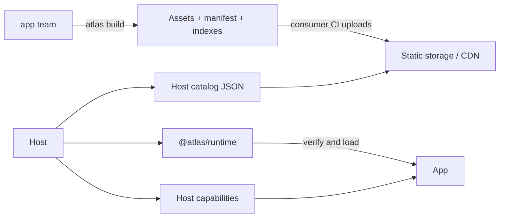

# Atlas

[](LICENSE)

Atlas is a TypeScript-first platform for independently built and deployed
apps. A stable host owns the page, routing, authentication, layout,
and shared UI services. Feature teams deploy apps without rebuilding
that host.

Atlas supports Angular and React hosts, apps, and exported widgets.
An Angular host can load React apps and a React host can load Angular apps. Vue is
a future target and is not currently supported.

## Documentation

New to Atlas? Follow [Getting started](docs/getting-started.md). It takes one
host and one app from an empty directory to a provider-neutral, verified
production deployment blueprint.

Choose docs by goal:

| Goal | Guide |
| --- | --- |
| Learn Atlas concepts | [Overview](docs/overview.md) and [architecture](docs/architecture.md) |
| Build a first system | [Angular](docs/angular/getting-started.md) or [React](docs/react/getting-started.md) |
| Develop an app in a real host | [Local development](docs/local-development.md) |
| Add routes or host services | [Angular routing](docs/angular/routing.md), [React routing](docs/react/routing.md), [Angular SDK](docs/angular/sdk.md), or [React SDK](docs/react/sdk.md) |
| Deploy safely | [Production deployment](docs/production-deployment.md), [Angular details](docs/angular/production-deployment.md), [React details](docs/react/production-deployment.md), and [production readiness](docs/production-readiness.md) |
| Diagnose a problem | [Angular troubleshooting](docs/angular/troubleshooting.md) or [React troubleshooting](docs/react/troubleshooting.md) |

Reference docs cover the [public API](docs/api.md), [manifest](docs/manifest.md),
[static registry](docs/registry.md), [security](docs/security.md),
[workspaces](docs/workspaces.md), [exported widgets](docs/exported-widgets.md),
and [consumer testing](docs/consumer-testing.md). Atlas maintainers should use
[repository testing](docs/testing.md) and [release](docs/releasing.md) guides.

## What Atlas Provides

- Interactive generators for hosts, apps, and exported widgets.
- Dynamic discovery through static JSON catalogs, with no registry service.
- Native Federation hidden behind framework adapters and generated wiring.
- One selected runtime version per app, plus PR and historical versions.
- Local development inside the real host instead of a standalone app.
- Typed host capabilities for HTTP clients, events, navigation, overlays,
  configuration, and host-specific extensions.
- Host-owned top-level routing with native Angular Router or React Router inside
  each app.
- SHA-256 verification for generated production remote entries and stylesheets,
  plus origin restrictions for remote loading.
- Provider-neutral output for Nginx, S3, Artifactory, Azure, or another CDN.

## The Mental Model



The **host** is the main application. It owns the browser document, session,
top-level routes, slots, and visual providers such as modals and toasts.

An **app** owns a feature. It is mounted by a host and is not a
standalone product application.

A **manifest** describes one built app version, including its immutable asset
URL, integrity hash, framework, supported hosts, routes, slots, and widgets.

A **catalog** selects exactly one version of every app needed by one host. It is
ordinary JSON served from the consumer's static storage.

## Quick Start

Requirements: Node.js `^20.19.0`, `^22.12.0`, or `>=24.0.0`, plus npm,
pnpm, or Yarn. These ranges match the generated Vite 7 and Angular toolchains.
Check before installing Atlas:

```sh
node --version
```

```sh
npm install --global @atlas/cli
```

Choose one same-framework path while learning. If you want to try both, use
separate scratch directories or different project names so the generated
`customer-host/` and `orders/` folders do not collide.

```sh
# Angular
atlas g host customer-host --framework=angular
atlas g app orders --framework=angular --host=customer-host

# React
atlas g host customer-host --framework=react
atlas g app orders --framework=react --host=customer-host
```

Generation creates `customer-host/` and `orders/` under the current directory and
installs dependencies unless `--skip-install` is passed. Commands are interactive
when required values are omitted:

```sh
atlas g
```

From the directory containing both projects, run the host and app in separate
terminals:

```sh
# Terminal 1
atlas dev customer-host

# Terminal 2
atlas dev orders \
  --host=customer-host \
  --host-url=http://localhost:5173/orders
```

Local app replacement uses the Atlas Columbus browser extension. Obtain the
extension from your platform team. Atlas repository contributors can build and
load it with the [Columbus instructions](apps/columbus/README.md).

Use the local host URL printed by `atlas dev customer-host`. React hosts usually
start on `http://localhost:5173`; Angular hosts usually start on
`http://localhost:4200`.
For an Angular host, use `--host-url=http://localhost:4200/orders`. Run this
from the directory that contains both generated projects, or from your monorepo
root.

Prepare production files without uploading them:

Quick start below uses global CLI. Real CI should pin `@atlas/cli` as exact
project dependency, commit lockfile, and invoke local binary.

```sh
ATLAS_VERSION=1.0.0 \
ATLAS_BUILD_ID="${BUILD_ID:?BUILD_ID is required}" \
ATLAS_REGISTRY_BASE_URL=https://cdn.example.com/atlas \
atlas build orders
```

The output is written under `orders/dist/atlas-publication`. Consumer CI uploads
it with its existing storage tooling. Atlas never needs cloud credentials.

Verify the deployed runtime, catalog, manifests, assets, integrity, and HTTP
delivery policy before promoting it:

```sh
atlas verify --runtime-url=https://customer.example/atlas.runtime.json
```

Success means verification reports no failures, every warning has an explicit
disposition, and the deployed host can open `/orders`, refresh a nested route,
use host-provided services, and load all app assets. Use the
[production-readiness checklist](docs/production-readiness.md) before enabling
real traffic.

Follow the complete [Angular](docs/angular/getting-started.md) or
[React](docs/react/getting-started.md) guide before building a real application.

## Developer Experience

App developers normally edit only:

- framework components, services, hooks, styles, and tests;
- `atlas.config.ts` when routes, hosts, slots, or widget dependencies change;
- exported widget components created by `atlas g widget`.

Atlas owns generated federation configuration, manifest generation, catalog
resolution, loading, mounting, local override documents, and CDN paths.
Angular projects may include a root `federation.config.js`; treat it as
Atlas-generated compatibility wiring for Native Federation, not as a second
configuration surface. Product teams configure Atlas in `atlas.config.ts`.

An app receives host services through one framework-native API:

```ts
// React
import { useAtlasSdk } from "@atlas/sdk/react";
import type { AtlasEventMap } from "@atlas/sdk";

const atlas = useAtlasSdk<{}, AtlasEventMap, { projectId: string }>();
await atlas.httpClient.get("/api/orders");
atlas.hostData.projectId;
```

```ts
// Angular
import { injectAtlasSdk } from "@atlas/sdk/angular";
import type { AtlasEventMap } from "@atlas/sdk";

const atlas = injectAtlasSdk<{}, AtlasEventMap, { projectId: string }>();
atlas.hostData.projectId;
```

Atlas supplies a default `HttpClient` backed by `globalThis.fetch`. Hosts can
replace `httpClient` in `startHost` when they need axios, authentication,
interceptors, or another transport. Hosts also supply modal framework, toast
library, extra typed `hostData`, and SDK extensions.

## Packages

| Package | Responsibility |
| --- | --- |
| `@atlas/schema` | Public configuration, manifest, catalog, and validation types |
| `@atlas/sdk` | app-to-host communication and framework adapters |
| `@atlas/runtime` | Discovery, trust checks, federation loading, and lifecycle |
| `@atlas/cli` | Interactive generation, local development, and build preparation |
| `@atlas/generators` | Generator implementation used by the CLI |
| `@atlas/testkit` | Typed test fixtures and in-memory host utilities |

## Repository Development

```sh
yarn install --frozen-lockfile
yarn build
yarn typecheck
yarn test
yarn test:generated
yarn test:e2e
```

The repository is a Yarn workspace orchestrated by Turborepo. `yarn build`
builds publishable Atlas packages and the Columbus extension in dependency order;
`yarn build:examples` builds the complete Angular/React example matrix. Turbo
caches package outputs locally in `.turbo`.

`test:generated` packs the real packages, installs the packed CLI in clean
projects, generates Angular and React hosts/apps, and production-builds them.
Browser E2E tests verify cross-framework loading and Columbus extension overrides.

See [CONTRIBUTING.md](CONTRIBUTING.md) for repository structure and the full
pre-pull-request checklist.

Atlas is available under the [MIT License](LICENSE).
