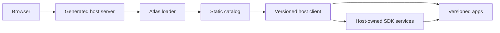

# Atlas

[](LICENSE)

Atlas is a TypeScript-first platform for products made from independently
released frontend applications. It provides:

- an editable Node.js host server for HTTP bootstrap and product integrations;
- a versioned host client for layout, routing, authentication integration, and
  shared services;
- versioned Angular and React apps loaded through Native Federation;
- a static registry and catalog model for safe release, verification, and
  rollback;
- a typed SDK for communication between apps and their host.

Angular hosts can load React apps, and React hosts can load Angular apps. Atlas
currently supports client-side rendering; Vue and server-side rendering are not
supported.

## Start Here

New to Atlas? Follow one path, in order:

1. [Understand Atlas](docs/overview.md) — vocabulary and ownership boundaries.
2. [Go from zero to production](docs/getting-started.md) — generate, develop,
   build, deploy, publish, verify, and roll back one host and one app.
3. Use the [documentation map](docs/README.md) for framework, task, and reference
   guides.
4. Complete the [production-readiness checklist](docs/production-readiness.md)
   before serving real traffic.

Do not begin with package or API reference unless you already know which Atlas
contract you need.

## How Atlas Fits Together



The host server serves the HTML document, browser loader, runtime configuration,
health endpoints, and product-specific server behavior. The host client and apps
are immutable UI artifacts published independently to public object storage or a
CDN. A catalog selects which host-client and app builds run together.

Read [Architecture](docs/architecture.md) for the complete loading and release
model.

## First Local System

Requirements: Node.js `^20.19.0`, `^22.12.0`, or `>=24.0.0`, plus npm, pnpm, or
Yarn.

```sh
npm install --save-dev --save-exact @atlas/cli

npx atlas g host customer-host --framework=react
npx atlas g app orders --framework=react --host=customer-host
```

Use `--framework=angular` for Angular. Start the generated host and app from the
directory containing both projects:

```sh
# Terminal 1
npx atlas dev customer-host

# Terminal 2
npx atlas dev orders --host-url=http://127.0.0.1:4300/orders
```

This proves local composition only. Production needs a public registry,
publication adapter, deployed host server, verification, and rollback plan.
Continue with [Zero to production](docs/getting-started.md).

## Packages

| Package | Responsibility |
| --- | --- |
| `@atlas/cli` | Generation, local development, build, publication, verification, and rollback |
| `@atlas/host-server` | HTTP bootstrap, browser loader, health, headers, and recovery |
| `@atlas/runtime` | Catalog discovery, trust checks, federation loading, and lifecycle |
| `@atlas/sdk` | Typed app-to-host contracts and framework adapters |
| `@atlas/schema` | Configuration, manifest, registry, and catalog contracts |
| `@atlas/generators` | Generator implementation used by the CLI |
| `@atlas/testkit` | Fixtures and in-memory host utilities for consumer tests |

## Contributing

```sh
yarn install --frozen-lockfile
yarn build
yarn typecheck
yarn test
```

See [CONTRIBUTING.md](CONTRIBUTING.md) for repository checks and
[documentation guidelines](docs/documentation-guide.md) for documentation
structure and maintenance rules.

Atlas is available under the [MIT License](LICENSE).
