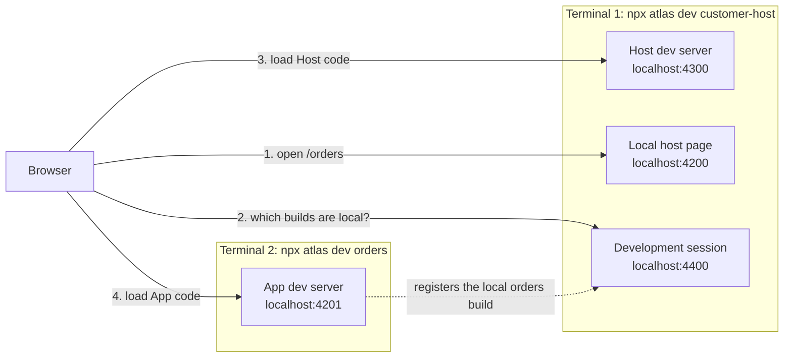

# Tutorial

In this tutorial, you create a React Host and a React App in an empty folder,
run both on your machine, and see the App inside the Host in your browser. It
takes about 15 minutes and assumes no prior Atlas knowledge. You need basic
familiarity with the terminal and with React or Angular.

By the end, you will have:

- a Host called `customer-host` with a header, a navigation menu, and a route
  outlet;
- an App called `orders` that appears at `/orders` in that Host;
- both running locally with `npx atlas dev`.

If a term is new to you, look it up in the [Glossary](../introduction/glossary.md).

## Before you start

You need:

- **Node.js 22.12 or later in the 22.x line, or Node.js 24** (`^22.12.0 || ^24.0.0`).
  Check with `node --version`.
- **npm**, which ships with Node.js.
- **Access to the npm registry that hosts the `@atlas` packages.** The
  `@atlas` packages are not published to the public npm registry
  (npmjs.org). If your organization publishes them to a private registry, add
  the scope to your user `.npmrc`, for example
  `@atlas:registry=https://registry.example.com/`. Ask your platform team for
  the URL.
- **A modern browser.** You do not need the [Columbus](../guides/columbus.md)
  extension for this tutorial. Columbus is only needed when you run a local
  App against a Host that is deployed somewhere else.

Ports 4200, 4201, 4300, and 4400 must be free.

## 1. Create a project folder

Run these commands in a terminal:

```sh
mkdir atlas-tutorial
cd atlas-tutorial
npm init -y
```

This creates an empty project with one `package.json`. Atlas calls this
layout a standalone project. Atlas also works inside Nx, Turborepo, and npm,
pnpm, or Yarn workspaces; see [Workspaces and CI](../guides/workspaces-and-ci.md)
when you are ready to add Atlas to an existing repository.

## 2. Install the Atlas CLI

In the `atlas-tutorial` folder, run:

```sh
npm install --save-dev --save-exact @atlas/cli
```

Check that the CLI works:

```sh
npx atlas --help
```

> **Expected result:** The command prints the Atlas command list, including
> `generate`, `dev`, `publish`, and `deploy`.

## 3. Generate the Host

The Host is the page users open. It owns the layout and the navigation, and it
shows Apps inside it. In the `atlas-tutorial` folder, run:

```sh
npx atlas g host customer-host --framework=react
```

Atlas creates the project in `apps/customer-host` and installs its
dependencies. This can take a minute.

> **Expected result:** The output ends with lines similar to these:
>
> ```text
> Atlas · Generate host · customer-host
> i Detected a standalone project at /Users/you/atlas-tutorial.
> i Atlas will generate the React scaffold directly at apps/customer-host.
> i Installing dependencies with npm
> ✓ Installed dependencies
> ✓ Created "customer-host" at /Users/you/atlas-tutorial/apps/customer-host.
> ```

Open `apps/customer-host/atlas.config.ts`. It looks like this, with a
different UUID:

```ts
import type { AtlasHostConfig } from '@atlas/schema' with {
  'resolution-mode': 'import',
};

export default {
  type: 'host',
  id: '0a17281f-287b-4d89-a8ca-0ab0e577c506',
  name: 'Customer Host',
  framework: 'react',
} satisfies AtlasHostConfig;
```

The `id` is the host ID. Apps use it to say which Host they appear in. Copy
your own value; you need it in the next step.

## 4. Generate the App

An App is a feature that appears inside a Host. In the `atlas-tutorial`
folder, run the following command. Replace the UUID with the host ID you
copied in step 3:

```sh
npx atlas g app orders --framework=react --host-id=0a17281f-287b-4d89-a8ca-0ab0e577c506 --routing
```

`--routing` creates sample inner routes (a home page and a details page), so
Atlas does not ask you about them.

> **Expected result:** Atlas creates `apps/orders` and installs its
> dependencies. The output ends with
> `✓ Created "orders" at /Users/you/atlas-tutorial/apps/orders.`

Open `apps/orders/atlas.config.ts`. The `routes` entry tells Atlas to show this
App at `/orders` in your Host and to add an **Orders** item to the Host's
navigation:

```ts
routes: [
  {
    hostId: '0a17281f-287b-4d89-a8ca-0ab0e577c506',
    path: '/orders',
    title: 'Orders',
    nav: { label: 'Orders', visible: true },
  },
];
```

## 5. Tell the App which Host page to open

When you run an App with `npx atlas dev`, Atlas needs to know which Host page
to show it in. You declare that page in the App's `package.json`. Without it,
`npx atlas dev orders` stops with the error
`package.json atlas.previews is required for atlas dev apps.`

Open `apps/orders/package.json`. Find the generated `atlas` field and add the
local Host address to `previews`:

```json
{
  "atlas": {
    "previews": ["http://localhost:4200"]
  }
}
```

The local Host always runs on `http://localhost:4200` unless you change its
port. Because the URL has no path, Atlas adds the App's route path and opens
`http://localhost:4200/orders`.

## 6. Start the Host

Open a terminal in the `atlas-tutorial` folder and run:

```sh
npx atlas dev customer-host
```

Leave this terminal running.

> **Expected result:** After the React dev server starts, the output ends with
> lines similar to these, and your browser opens the Host:
>
> ```text
> Atlas · Develop · customer-host
> i Starting React dev server on port 4300
> ✓ Dev server ready in 2.4s
> i Local host page running at http://localhost:4200
> App preview: http://localhost:4200
> ```
>
> The page shows an **Atlas** header and an empty navigation menu. No App is
> running yet.

## 7. Start the App

Open a second terminal in the `atlas-tutorial` folder and run:

```sh
npx atlas dev orders
```

Leave this terminal running too.

> **Expected result:** The output ends with lines similar to these, and your
> browser opens the Orders page:
>
> ```text
> Atlas · Develop · orders
> i Starting React dev server on port 4201
> ✓ Dev server ready in 1.9s
> App preview: http://localhost:4200/orders
> ```

## 8. See the App in the Host

Look at the browser tab at `http://localhost:4200/orders`. If the page was
already open, reload it.

> **Expected result:** The page shows the Host's **Atlas** header, an
> **Orders** item in the navigation, and, below it, the Orders App: an
> **Orders** heading, **Home** and **Details** links, and the text
> **Orders home**. Select **Details** and the URL changes to
> `/orders/details/42`.

Now edit `apps/orders/src/home/Home.tsx`, change the text, and save. The App's
dev server rebuilds; reload the page to see the change.

To stop, press `Ctrl+C` in each terminal.

## How it works



1. `npx atlas dev customer-host` started the Host's Vite dev server on port
   4300, a local host page on port 4200 that plays the role of the production
   bootstrap page, and a development session on port 4400.
2. `npx atlas dev orders` started the App's Vite dev server on port 4201 and
   registered the local Orders build with the development session that was
   already running.
3. The local host page read the development session instead of a deployed
   registry. It loaded the Host from port 4300, matched `/orders` to the
   Orders route, and loaded the App from port 4201 into the Host's route
   outlet.

In production, the same Host and App code is loaded from an artifact registry
instead of local dev servers. [Architecture](../introduction/architecture.md)
explains that flow.

## Try Angular instead

Every step works the same with Angular. Use `--framework=angular` in steps 3
and 4. Atlas lets you mix frameworks, so an Angular Host can show a React App.

## Troubleshooting

- **`package.json atlas.previews is required for atlas dev apps.`** You skipped
  step 5. Add the `previews` entry to `apps/orders/package.json`.
- **The Orders page is blank or shows a loading error.** Make sure the Host is
  still running in the first terminal, then reload the page.
- **A port is already in use.** Stop the other process, or see
  [Local development](../guides/local-development.md) for the `--port`,
  `--bootstrap-port`, and `--control-port` options.
- **`npm install` fails with `404 Not Found` for `@atlas/cli`.** npm cannot
  find the `@atlas` packages. Configure the `@atlas` scope in your `.npmrc`, as
  described in [Before you start](#before-you-start).

For other problems, see [Troubleshooting](../troubleshooting.md).

## Next steps

- [Hosts](../concepts/hosts.md) and [Apps](../concepts/apps.md): learn what each
  side owns and how they connect.
- [React Host guide](../guides/react/host.md) or
  [Angular Host guide](../guides/angular/host.md): customize the layout,
  navigation, and shared services.
- [React App guide](../guides/react/app.md) or
  [Angular App guide](../guides/angular/app.md): build real screens and use the
  SDK.
- [Production deployment](../deploy/production-deployment.md): publish and
  deploy your projects.
