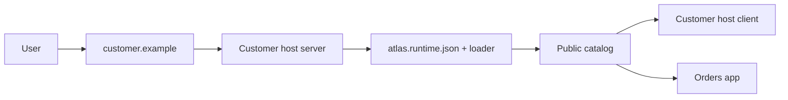

# Zero To Production

Audience: team evaluating or adopting Atlas. This tutorial starts in an empty
directory and ends with one host and one app deployed, verified, and ready to
roll back.

Follow steps in order. Use React or Angular throughout this first run; Atlas can
mix frameworks after the release model is familiar.

## Finished System



Production contains two delivery paths:

1. Deploy generated host-server code through normal server delivery tooling.
2. Publish immutable host-client and app artifacts plus mutable catalog JSON to
   public object storage or a CDN.

UI releases do not redeploy an unchanged server. Server releases do not choose
UI versions.

## 0. Prepare

You need:

- Node.js `^20.19.0`, `^22.12.0`, or `>=24.0.0`;
- npm, pnpm, or Yarn;
- public HTTPS object storage or a CDN for production artifacts;
- a publication identity allowed to create immutable files, replace mutable
  JSON, and hold a shared registry lock;
- a Node.js deployment target for the host server;
- the Columbus browser extension for local host/app replacement.

Node ranges satisfy generated Angular and Vite 7 toolchains. Check installed
version:

```sh
node --version
```

Examples use these placeholders:

| Example | Replace with |
| --- | --- |
| `customer-host` and `orders` | Local project names |
| `0a17281f-287b-4d89-a8ca-0ab0e577c506` | Generated host UUID |
| `2bea9c13-4899-4f93-9211-cd8c55e9c529` | Generated app UUID |
| `cdn.example.com/atlas` | Public registry base URL |
| `customer.example` | Public host domain |

Never copy sample UUIDs into generated projects. Atlas creates stable UUIDs in
each `atlas.config.ts`.

## 1. Create A Workspace And Pin The CLI

Run from a new or existing workspace root:

```sh
mkdir atlas-walkthrough
cd atlas-walkthrough
npm init --yes
npm install --save-dev --save-exact @atlas/cli
```

Commit the package lockfile in a real project. Use the local CLI through `npx`
or a package script; production CI should not depend on a floating global CLI.

Checkpoint:

```sh
npx atlas --version
npx atlas --help
```

Both commands should complete without downloading another Atlas version.

## 2. Generate One Host And One App

Choose one framework. React path:

```sh
npx atlas g host customer-host --framework=react
npx atlas g app orders --framework=react --host-id=0a17281f-287b-4d89-a8ca-0ab0e577c506
```

Angular path:

```sh
npx atlas g host customer-host --framework=angular
npx atlas g app orders --framework=angular --host-id=0a17281f-287b-4d89-a8ca-0ab0e577c506
```

Generation installs project dependencies unless `--skip-install` is passed.
After generating the host, copy its stable UUID from
`customer-host/atlas.config.ts` into `--host-id`. Generator writes that exact
value into app route declaration. This works whether projects share a repo or
live in separate repos.

Checkpoint: these files exist:

```text
customer-host/
  atlas.config.ts
customer-host-server/
  main.mts
orders/
  atlas.config.ts
```

## 3. Understand What You Own

Before editing code, locate ownership boundaries:

| Location | Owner | Purpose |
| --- | --- | --- |
| `customer-host-server/main.mts` | Host/server team | HTTP bootstrap, auth middleware, BFF routes, errors, observability |
| `customer-host/atlas.config.ts` | Host team | Stable host identity and source configuration |
| Host `src/` | Host team | Product shell, top-level routes, layout, SDK services |
| `orders/atlas.config.ts` | App team | Stable app identity, host placement, routes, slots, widgets |
| Orders `src/` | App team | Feature UI, inner routes, assets, tests |
| `.atlas/` and `dist/` | Atlas and framework tools | Generated local and build output; do not edit |

Project names identify local folders and CLI targets. UUIDs identify published
artifacts and survive project renames.

Read framework files now:

- [Angular project guide](angular/getting-started.md)
- [React project guide](react/getting-started.md)

Return here after identifying host layout, host lifecycle, app entry, and app
route files.

## 4. Run The Complete Local Composition

Open two terminals at workspace root.

```sh
# Terminal 1: host server and local host client
npx atlas dev customer-host
```

```sh
# Terminal 2: local Orders app mounted at its host route
npx atlas dev orders --host-url=http://127.0.0.1:4300/orders
```

Open URL printed by the CLI, normally `http://127.0.0.1:4300/orders`. The host
preview uses port `4300`; framework asset servers commonly use `4200` and `4201`.

Columbus applies local selections in the browser. It can replace the host client
and app independently, then reset both to deployed production selections. See
[Local development and Columbus](local-development.md) before using local host
code on a deployed domain.

Checkpoint:

- host shell renders;
- Orders renders inside the host route;
- full-page refresh keeps `/orders` working;
- `http://127.0.0.1:4300/health/ready` returns `ready`;
- Columbus shows separate host and Orders selections.

If CLI reports `No host configured for "orders"`, compare app route `hostId`
with host UUID in `customer-host/atlas.config.ts`. They must match exactly.

## 5. Add Tests And Build Before Deployment

Replace generated example UI with smallest useful product slice. Keep host route,
navigation, status, and slot anchors used by app configuration. Apps should use
SDK services instead of importing host source.

Standalone generated projects intentionally do not choose a test runner or
define a `test` script. Add the runner used by your organization and cover
feature behavior, mount/unmount lifecycle, and required SDK contracts. Do not
treat `npm test --if-present` as evidence; it succeeds without running anything
when script is absent.

Run your test commands, then production-build both clients and server:

```sh
npm --prefix customer-host run build
npm --prefix orders run build
npm --prefix customer-host-server run build
```

Checkpoint: organization test jobs pass, both framework builds complete, and
`customer-host-server/dist/main.mjs` exists.

Use [Consumer testing](consumer-testing.md) for SDK and lifecycle contract tests.
Use framework routing and SDK guides for product code:

- [Angular routing](angular/routing.md) and [Angular SDK](angular/sdk.md)
- [React routing](react/routing.md) and [React SDK](react/sdk.md)

## 6. Create A Public Registry

Atlas registry is a static file contract. It needs no registry service, but
browsers must reach it over HTTPS with CORS allowing the host origin.

Choose public base URL:

```sh
export ATLAS_REGISTRY_BASE_URL=https://cdn.example.com/atlas
```

Generate publication adapter configuration at workspace root:

```sh
npx atlas generate publish-config
```

The generated `atlas.publish.ts` uses Atlas's S3-compatible adapter. Configure
endpoint, bucket, prefix, region, and credentials through protected CI
environment. For another provider, implement `AtlasPublicationStorage` in that
file.

Atlas does not infer provider credentials. Browser-visible runtime configuration
and host-server environment must never contain publication credentials.

Checkpoint: publication identity can acquire the shared lock, create a test
object, replace a test object, read both, and remove them. Public URL returns
correct CORS and MIME headers.

Read [Registry and publishing](registry.md) for required layout, permissions,
cache policy, concurrency, and adapter contract.

## 7. Build The Host-Client Artifact

Build host client first. Command creates exact artifact and ordered publication
plan without uploading:

```sh
ATLAS_VERSION=1.0.0 \
ATLAS_BUILD_ID="${HOST_BUILD_ID:?HOST_BUILD_ID is required}" \
  npx atlas build customer-host
```

Project writes:

```text
dist/atlas-publication/       files to upload
dist/atlas-publication.json   ordered publication plan
```

Host paths begin `hosts/<host-id>/1.0.0/<build-id>/`. Version label identifies
release; build ID identifies exact immutable bytes.

Checkpoint: inspect plan and dry-run exact publication:

```sh
npx atlas publish \
  --plan=customer-host/dist/atlas-publication.json \
  --dry-run

```

No public storage should change during dry run.

## 8. Deploy The Host Server

Deploy `customer-host-server/dist/main.mjs`, required production dependencies,
and runtime environment through existing Node.js delivery tooling. Atlas does
not generate a container, cloud manifest, or CI pipeline.

Generated server embeds host UUID. Configure environment-specific catalog and
trusted asset origin:

```sh
ATLAS_CATALOG_URL=https://cdn.example.com/atlas/hosts/0a17281f-287b-4d89-a8ca-0ab0e577c506/catalog.json
ATLAS_ASSET_ORIGINS=https://cdn.example.com
PORT=8080
```

Replace sample host UUID in catalog URL with UUID from
`customer-host/atlas.config.ts`. Connect `customer.example` to this server.

The catalog does not exist until host client is published. Loader may show a
startup error during this stage; server health must still pass:

```sh
curl --fail https://customer.example/health/live
curl --fail https://customer.example/health/ready
curl --fail https://customer.example/atlas.runtime.json
```

Read [Host server](host-server.md) for HTTP and extension contracts and
[Security](security.md) before exposing production traffic.

## 9. Publish Host Client, Then Build And Publish App

Run publication from protected CI with committed `atlas.publish.ts` and storage
credentials. Publish exact host plan inspected in step 7:

```sh
npx atlas publish \
  --plan=customer-host/dist/atlas-publication.json \
  --runtime-url=https://customer.example/atlas.runtime.json
```

Now build Orders against updated public registry, inspect exact plan, then
publish it:

```sh
ATLAS_VERSION=1.0.0 \
ATLAS_BUILD_ID="${APP_BUILD_ID:?APP_BUILD_ID is required}" \
ATLAS_REGISTRY_BASE_URL=https://cdn.example.com/atlas \
  npx atlas build orders

npx atlas publish \
  --plan=orders/dist/atlas-publication.json \
  --dry-run

npx atlas publish \
  --plan=orders/dist/atlas-publication.json \
  --runtime-url=https://customer.example/atlas.runtime.json
```

`publish` acquires registry lock, checks live revision, uploads immutable bytes,
updates indexes, activates host catalogs last, verifies public deployment, and
releases lock. Verification failure restores previous mutable selection before
lock release.

Transfer complete `dist/atlas-publication/` plus its plan when build and publish
use separate jobs. See [Production deployment](production-deployment.md).

Checkpoint: public catalog selects host client and Orders build, while server
artifact remains unchanged.

## 10. Verify The User Path

Run HTTP verification explicitly after CDN propagation:

```sh
npx atlas verify \
  --runtime-url=https://customer.example/atlas.runtime.json
```

Atlas checks runtime, catalog, manifests, route ownership, CORS, MIME and cache
headers, integrity, federation metadata, styles, and federation expose files.
External widget providers require separate browser checks against approved
registries.

Then test in a browser:

- host root loads without console errors;
- `/orders` loads selected Orders version;
- a nested route survives full-page refresh;
- critical assets and lazy chunks load;
- authenticated HTTP and other host SDK services work;
- loading and failure UI is usable;
- monitoring identifies host/app/version/build and failure stage.

Warnings need explicit review; zero command failures alone does not prove
authentication, rendering, accessibility, monitoring, or incident readiness.
Complete [Production readiness](production-readiness.md) before traffic.

## 11. Rehearse Rollback

Rollback uses stable artifact UUID, not local project name. Read IDs from each
`atlas.config.ts`.

First publish a second Orders version so rollback has a real earlier target:

```sh
ATLAS_VERSION=1.1.0 \
ATLAS_BUILD_ID="${APP_BUILD_ID_1_1:?APP_BUILD_ID_1_1 is required}" \
ATLAS_REGISTRY_BASE_URL=https://cdn.example.com/atlas \
  npx atlas build orders

npx atlas publish \
  --plan=orders/dist/atlas-publication.json \
  --runtime-url=https://customer.example/atlas.runtime.json
```

Preview rollback to published `1.0.0`:

```sh
APP_ID=2bea9c13-4899-4f93-9211-cd8c55e9c529

npx atlas rollback "$APP_ID" \
  --version=1.0.0 \
  --dry-run
```

Publish and verify selection:

```sh
npx atlas rollback "$APP_ID" \
  --version=1.0.0 \
  --runtime-url=https://customer.example/atlas.runtime.json
```

If a version has several builds, add `--build-id=<exact-build-id>`. Rollback
selects existing immutable bytes; it does not rebuild app, overwrite artifacts,
or redeploy server.

Checkpoint: verification passes, browser shows selected earlier build, and team
can identify previous and current catalog revisions in audit trail.

## Next Work

- Customize host: [Angular host](angular/host-getting-started.md) or [React host](react/host-getting-started.md)
- Build feature apps: [Angular app](angular/app-getting-started.md) or [React app](react/app-getting-started.md)
- Operate releases: [Production deployment](production-deployment.md)
- Review design: [Architecture](architecture.md)
- Find exact contract: [Documentation map](README.md)
