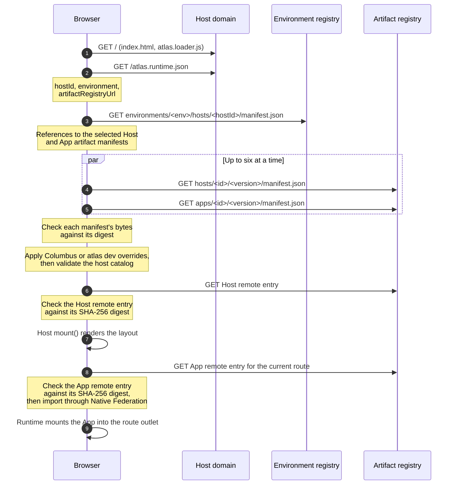
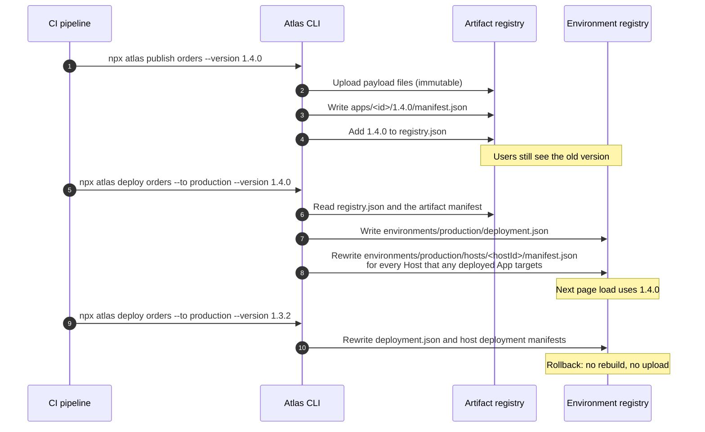
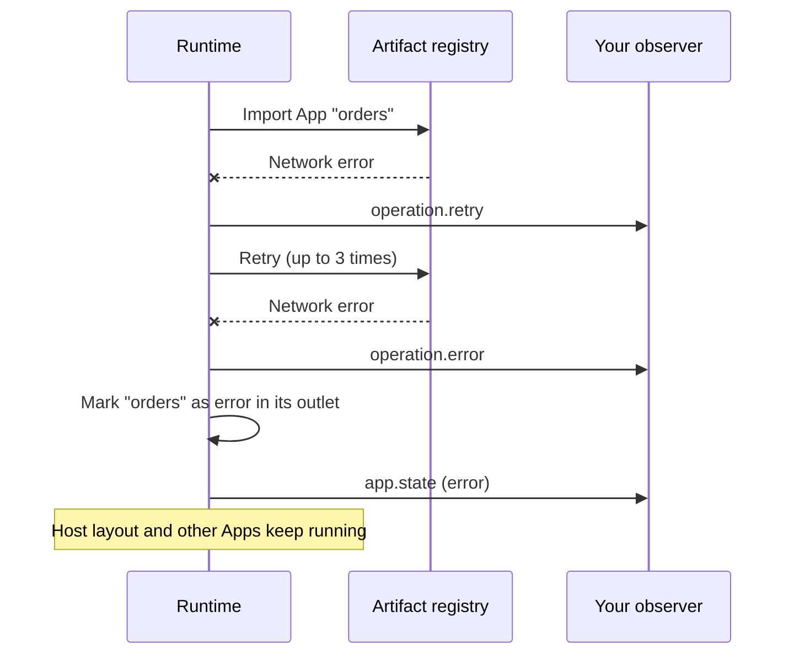

# Architecture

This page explains what happens in the browser when a user opens an Atlas Host, what happens in storage when you publish and deploy, and how Atlas keeps one broken App from breaking the page. It also explains the design decisions behind the model and their costs. Read [Overview](overview.md) first if the terms Host, App, and artifact are new to you.

## The core idea

Atlas separates two kinds of data:

- **Immutable artifacts.** Every published Host or App version is a set of files plus a [published artifact manifest](glossary.md#published-artifact-manifest) that lists their SHA-256 digests. Atlas stores each version at its own versioned path, such as `apps/<id>/<version>/`, and never changes it after publishing.
- **Mutable environment state.** A small JSON file per environment records which versions are selected, and one [host deployment manifest](glossary.md#host-deployment-manifest) per Host lists the exact artifacts that Host loads.

Building, publishing, and deploying are separate steps with separate owners:

| Step    | Command                                                               | Writes                                                                                                      |
| ------- | --------------------------------------------------------------------- | ----------------------------------------------------------------------------------------------------------- |
| Build   | Your framework build (Vite or the Angular CLI)                        | Local build output only.                                                                                    |
| Publish | `npx atlas publish <project> --version <version>`                     | Artifact files, the published artifact manifest, and an entry in `registry.json` in the artifact registry.  |
| Deploy  | `npx atlas deploy <artifact> --to <environment> --version <selector>` | `environments/<environment>/deployment.json` and `environments/<environment>/hosts/<hostId>/manifest.json`. |
| Serve   | Your hosting platform                                                 | The bootstrap files and `atlas.runtime.json` on the Host's domain.                                          |

The [Registry reference](../reference/registry.md) documents the storage layout, and [Production deployment](../deploy/production-deployment.md) walks through the release commands.

## How the browser loads a page

The bootstrap page (`index.html`, `atlas.loader.js`, and `es-module-shims.js`) is the same for every release. It learns everything else at runtime.

In words:

1. The loader fetches `atlas.runtime.json` from the page's own origin. This file names the Host ID, the environment, and the registry URLs. Your platform serves it, so the same bootstrap files work in every environment.
2. The loader fetches the host deployment manifest for that Host ID and environment. It rejects the file if the Host ID or environment inside it do not match the runtime config.
3. The loader downloads the referenced published artifact manifests in parallel (up to six at a time) and checks each one against the digest recorded in the host deployment manifest.
4. If Columbus or a running `npx atlas dev` session provides overrides, the loader applies them now. It then validates the resulting [host catalog](glossary.md#host-catalog).
5. The loader downloads the Host's remote entry, checks it against the SHA-256 integrity value from the Host's artifact manifest, and calls the Host's `mount()` function.
6. The runtime inside the Host matches the URL against the Apps' routes and slots. For each App it needs to show, it checks the App's remote entry against its integrity value, imports the App through Native Federation, and calls the App's `mount()` function inside an isolated container.

When the artifact registry is on a different origin than the page, the loader adds a `preconnect` hint for it so that the TLS handshake overlaps with the first requests.

### What the integrity checks cover

Atlas verifies these files before it uses them:

- **Published artifact manifests.** The loader hashes each manifest and compares it with the digest in the host deployment manifest.
- **Remote entries.** The loader and the runtime hash each Host or App remote entry and compare it with the manifest's `integrity` value. Published manifests always carry this value. A manifest without an `integrity` value, such as a local development override, skips the check.
- **Stylesheets.** The runtime adds each stylesheet with its `integrity` attribute, so the browser rejects a changed file through Subresource Integrity.

Lazy chunks that a remote entry imports after it loads are not verified, even though the published artifact manifest lists their digests. Protect those files with immutable storage and with control over who can publish; see [Security](../deploy/security.md).

## How publish, deploy, and rollback work

Because deploy only rewrites small JSON files, a rollback takes as long as writing those files. Artifact bytes are never copied between environments: staging and production point at the same immutable files. A deploy can also select the version currently running in another environment (`--version staging`) to promote it.

## How failures stay contained

Atlas treats every App as something that can fail independently.

- **Retries and timeouts.** In deployed Hosts, resource requests retry three times after a failure and time out after 15 seconds. The `resourcesRetryCount` and `resourcesTimeoutMs` fields in a Host's `atlas.config.ts` change these values only for the Host page that `npx atlas dev` serves. A deployed `atlas.runtime.json` rejects them unless its environment is `development`, so deployed Hosts always use the defaults.
- **App and Widget failures skip only that artifact.** If an App or Widget provider manifest cannot be downloaded, does not match its digest, or is not an App artifact, the loader leaves it out of the host catalog and logs `Atlas skipped "<path>" …` to the browser console. If an App's remote entry does not match its integrity value, the runtime does not run that App's code. A Widget that fails to load shows an error card with a retry button in its own container. In every case the Host and the other Apps keep loading.
- **Per-App error state.** A failed mount changes only that App's state to `error`. The Host shows its error UI through `AtlasHostStatus` or `<atlas-host-status>`; the layout and other Apps stay usable.
- **Host failures are fatal.** If the runtime config, the host deployment manifest, the Host's published artifact manifest, or the Host itself cannot load, the bootstrap page shows a recovery screen with an error code. A Host is the one artifact every page depends on, so deploy Host changes with the most care.
- **Observability.** The runtime emits `host.start`, `host.ready`, `host.error`, `operation.success`, `operation.retry`, `operation.error`, and `app.state` events. Forward them to your monitoring tool; see [Production readiness](../deploy/production-readiness.md).

## How framework adapters work

Every App, whatever its framework, exposes the same contract: a `mount()` function that receives a container and an App context, and returns a way to unmount. The `@atlas/sdk` framework adapters build that contract from normal framework code:

- **React Apps** use `defineApp` for an App without inner routes, or `createRoutedApp` with React Router's `createMemoryRouter` and Atlas's `createRouterOptions` for a routed App. Each mount owns one React root, and Atlas calls `root.unmount()` on teardown.
- **Angular Apps** use `defineApp` and `provideAtlasApp` from `@atlas/sdk/angular`. Routed Apps use Angular's router with Atlas's `createLocationStrategy`.
- **React Hosts** use `defineReactHost` from `@atlas/runtime/react`, which renders your layout inside `AtlasHostProvider`. The provider creates the Host SDK and starts the runtime after the React tree commits.
- **Angular Hosts** use `defineAngularHost` from `@atlas/runtime/angular`.

A routed App keeps using its framework's links, outlets, route parameters, and guards. Atlas synchronizes the App's in-memory router with the browser URL and scopes it to the App's base path, so `/orders/details/42` in the address bar becomes `/details/42` inside the Orders App.

Because the contract is framework-neutral, an Angular Host can mount a React App and a React Host can mount an Angular App.

## Design decisions

### Why Native Federation

Native Federation loads remote code as standard ES modules and uses import maps (through `es-module-shims`) to share dependencies between builds. It works with both Vite and the Angular CLI's esbuild builder, which lets Atlas support React and Angular with one runtime. It does not depend on a specific bundler's runtime, so each team can upgrade its build tooling on its own schedule.

### Why a static registry

The registry is plain files. The browser reads it over HTTP with no Atlas server in between, so it scales like any CDN content and has no service of its own to operate or secure. Published artifacts live at versioned paths and never change, so browsers and CDNs can cache them for a long time. The cost is that the registry cannot run logic: every decision, such as which versions are live, is made at deploy time and written down as a file.

### Why Shadow DOM by default

An App's CSS must not change the Host or other Apps, and the Host's CSS must not accidentally restyle an App. By default (`domIsolation: 'shadow-dom'`), Atlas mounts each App inside its own open Shadow DOM root and loads the App's stylesheets into that root. An App can opt out with `domIsolation: 'shared-dom'` in its `atlas.config.ts`, which renders it in the normal document and puts its styles in the document `<head>`.

## Shadow DOM limits

Shadow DOM isolates markup and styles, not scripts. Plan for these limits before you choose UI libraries:

- **Overlays and portals.** Libraries that render dialogs, menus, or tooltips into `document.body` render them outside the App's shadow root. The App's styles do not apply there. Configure the library to render into a container inside the App, or ask the Host team to expose an overlay service through a product-specific SDK extension.
- **Fonts.** Browsers ignore `@font-face` rules inside a shadow root. Declare shared fonts in the Host's global stylesheet; Apps can then use them by family name.
- **Third-party CSS.** Stylesheets that target `html`, `body`, or `:root` match nothing inside a shadow root. Atlas rewrites `:root` selectors to `:host`, but not `html` or `body` selectors. Global CSS resets and themes often need adjustment.
- **Global queries.** Code that calls `document.querySelector` cannot see elements inside an App's shadow root. Query from the App's own container instead.
- **JavaScript is shared.** All Apps share one `window` and one global scope, and they share a dependency with the Host only when the installed versions match exactly (see [Shared dependencies](../deploy/governance.md#shared-dependencies)). Shadow DOM is not a security boundary.

[Styles and isolation](../concepts/styles-and-isolation.md) explains how to work with these limits.

## Performance and startup cost

Compared with a single bundled application, Atlas adds these steps before the first App renders:

- **Sequential requests before the Host runs.** `atlas.runtime.json`, then the host deployment manifest, then the artifact manifests, then the Host remote entry. The runtime config and host deployment manifest are small, and artifact manifests load in parallel, but these are round trips you pay on every cold load. Serve the registry from a CDN close to your users, and let browsers cache immutable artifact files.
- **Digest verification.** The loader and the runtime hash each artifact manifest and each remote entry with the Web Crypto API before running it. This is fast compared with the network, but it is not free on low-end devices.
- **Lazy App loading.** The runtime imports an App's code only when a route or slot needs it, so the number of deployed Apps does not change the size of the first page.
- **Shared dependencies.** Atlas marks shared packages, such as the framework and `@atlas/sdk`, as `singleton: true` and `strictVersion: true` in the Native Federation build metadata, but the Native Federation runtime that loads Apps (`@softarc/native-federation-runtime` 3.5) never reads those flags. It matches shared packages by name and exact installed version. The Host's shared packages go into the root import map, and an App reuses the Host's copy only when its version matches exactly. On any mismatch, even a patch version, the App's scoped import map points at the copy bundled in its own artifact, and a second copy loads with no error or warning. The page then downloads more code, and anything shared across the boundary, such as React context and hooks or Angular dependency injection, can break. Use identical exact versions across teams; see [Shared dependencies](../deploy/governance.md#shared-dependencies).
- **Mixed frameworks cost more.** An Angular Host showing a React App loads both frameworks.

## Next steps

- [Tutorial](../get-started/tutorial.md): run a Host and an App locally.
- [Hosts](../concepts/hosts.md) and [Apps](../concepts/apps.md): build each side.
- [Production deployment](../deploy/production-deployment.md): publish and deploy for real.
- [Security](../deploy/security.md): the headers and policies your Host domain needs.
