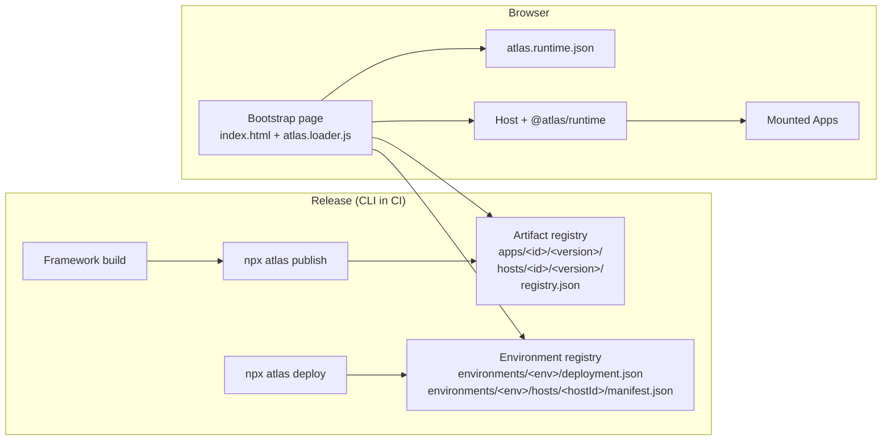

# Overview

Atlas is a micro-frontend platform for Angular and React. It lets several teams
build parts of one web product and release those parts independently, without a
coordinated release of the whole page. This page introduces the main parts of
Atlas and who owns them.

## The problem Atlas solves

In a single-page application that many teams work on, every change ships
through one build and one release. A small fix in one feature waits for the
whole product to be tested and deployed, and one broken feature can block
everyone else.

Atlas splits the product into a **Host**, the page users open, and **Apps**,
the features shown inside it. Each App is built, versioned, and released by its
own team. When the page opens, the Host loads the App versions that are
selected for the current environment. To learn when this trade-off is worth it,
read [Why Atlas](why-atlas.md).

## The main parts

| Term              | Meaning                                                                                                                    |
| ----------------- | -------------------------------------------------------------------------------------------------------------------------- |
| Host              | The application users open. It owns the page layout, sign-in, top-level navigation, and shared services.                   |
| App               | A feature, such as Orders, shown inside a Host. It owns its screens, its inner routes, and its release schedule.           |
| Widget            | A reusable component that an App exports so that other Apps or the Host can render it.                                     |
| Artifact manifest | The JSON file that describes one published Host or App version and the digests of its files.                               |
| Artifact registry | Static storage, such as a bucket behind a CDN, that holds every published version and the release catalog `registry.json`. |
| Deployment        | The versions selected for one environment, stored in `environments/<environment>/deployment.json`.                         |
| Runtime config    | `atlas.runtime.json`, served by the Host's domain. It tells the page which host ID, environment, and registry to use.      |
| Runtime           | The `@atlas/runtime` package. It runs in the Host and mounts the selected Apps.                                            |
| SDK               | The `@atlas/sdk` package. It gives Apps typed services from the Host: HTTP, events, navigation, and host data.             |

The [Glossary](glossary.md) defines every term in full.

## How the parts fit together

Publishing and deploying are separate steps:

1. **Publish** records a framework build as an immutable artifact. Nothing
   changes for users yet.
2. **Deploy** selects already-published versions for an environment. It writes
   only the deployment state and the host deployment manifests; it never
   copies artifact files.
3. **In the browser**, the loader reads `atlas.runtime.json`, then the host
   deployment manifest for its environment, then the artifact manifests. It
   checks each file's digest before it runs any code.

The Host does not hard-code App URLs, and an App does not choose which version
of itself runs in production. [Architecture](architecture.md) explains the
full loading and release model.

## What the Host team owns

The Host team decides:

- the host ID, the bootstrap page, and the domain the Host is served from;
- the page layout and where the host anchors (route outlet, slots, navigation)
  appear;
- sign-in, HTTP behavior, and other shared services exposed through the SDK;
- the loading, error, and notification UI;
- monitoring of runtime events;
- the `atlas.runtime.json` file and the security headers the hosting platform
  serves.

The Host team does not edit App source code to release App features.

## What an App team owns

An App team decides:

- the App's ID, name, and framework;
- which Hosts may show the App, and at which routes and slots;
- the App's components, styles, tests, assets, and inner routes;
- which widgets the App exports.

An App team does not own the browser document, the global layout, or which
version runs in production.

## What CI and operations own

Your CI pipeline builds each project with its framework tooling, then runs
`npx atlas publish` with a version your release tooling chooses, and
`npx atlas deploy` to select versions per environment. Your platform team owns
the storage, the CDN, the Host domains, and the `atlas.runtime.json` file and
security headers each domain serves. Atlas includes an S3-compatible storage
adapter and an Artifactory mode; the registry format itself is plain static
files.

## Next steps

- [Why Atlas](why-atlas.md): decide whether Atlas fits your product.
- [Tutorial](../get-started/tutorial.md): run a Host and an App on your machine.
- [Architecture](architecture.md): read how the browser loads a page and how
  releases work.
