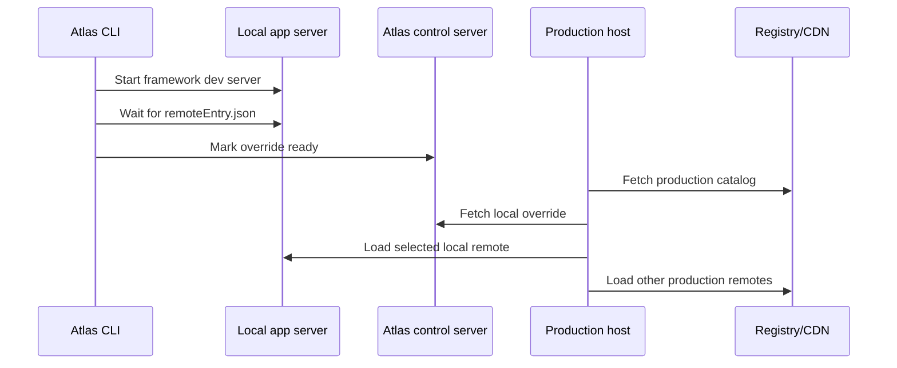

# Local Development

Atlas local development is designed around one principle: run the app locally, but render it in the real host.

## Why

apps depend on host services such as navigation, modals, toasts, configuration, and product-specific SDK extensions. Running them as standalone apps gives a false picture of production behavior.

## Flow

```sh
# React host generated by the getting-started guide
atlas dev customer-host

# Angular host generated by the getting-started guide
atlas dev customer-host
```

The command:

1. Generate a local manifest pointing to localhost.
2. Start the selected app's framework dev server.
3. Wait until its Native Federation remote entry is reachable.
4. Serve a validated override document from the Atlas control server.
5. Print a host URL that activates the override.
6. Let the host load every production app except the one being overridden.

Run the host separately with `atlas dev <host>` first, then run
`atlas dev <app>`. If your shell is already inside a generated host or app
directory, `atlas dev` uses that current Atlas project. Run named commands from
the directory that contains both generated projects, or from your monorepo root.
Atlas reads the app
`atlas.config.ts` and infers the host when there is only one configured host. If
there are multiple hosts, an interactive terminal asks which one to use; in
non-interactive shells, pass `--host` or set `ATLAS_HOST`.

Atlas delegates to Nx, Turborepo, pnpm, Yarn, npm, or the standalone project
script as needed. Then open the printed **Open host** URL from the app command.
The host discovers the override from its `atlas-override` query parameter,
while every other app continues to come from the production catalog. No Native
Federation URL or manifest needs editing.

Set local defaults in the terminal when you want a quick launch:

```sh
ATLAS_HOST=customer-host ATLAS_HOST_ORIGIN=http://localhost:4200 atlas dev orders
ATLAS_HOST_URL=http://localhost:4200/orders atlas dev orders
```

`ATLAS_HOST_URL` is the exact page URL. `ATLAS_HOST_ORIGIN` is only the origin;
Atlas appends the configured route base path for the selected host. For repeated
local work, add a workspace `.env` file:

```dotenv
ATLAS_HOST=customer-host
ATLAS_HOST_ORIGIN=http://localhost:4200
```

Shell environment variables override `.env` values. Flags override both.

Defaults are app port `4201` and Atlas control port `4400`. Use `--port` or `--control-port` only when necessary. Atlas writes a diagnostic copy to `.atlas/local-overrides.json`; developers do not maintain it.

The control server reports `503 starting` until the app is ready, so opening the printed URL cannot race framework startup. Generated React apps also initialize Vite Fast Refresh when imported by a host; Angular and React developers get their normal framework development behavior without extra setup.

Generated hosts accept an override URL under `atlas.runtime-override-url` and a complete override document under `atlas.runtime-overrides` in browser local storage. `atlas dev` uses the URL protocol; the Chrome extension uses the direct document protocol so it needs no background HTTP server of its own. Both receive the same SDK validation.

## What Happens Behind The Scenes



Atlas rejects an override that targets another host, has an invalid manifest, or uses an app id that differs from its embedded manifest.

## PR And Historical Versions

The same override protocol can choose:

- a PR version for review
- a historical version for debugging
- a local version for development

The host does not need to redeploy for these changes.

## Chrome Extension

Build the extension with `yarn workspace @atlas/chrome-extension build`, then load `apps/chrome-extension/dist` as an unpacked extension from `chrome://extensions`.

The popup discovers the active host from `/atlas.runtime.json`, reads its catalog, and reads each static app index for all versions of each selected app. Choices are persisted per `hostId`. Applying changes writes one atomic override document into the host origin and reloads the tab. Widgets follow their owner app version automatically and are not selected independently.

Overrides apply to **All tabs** by default using origin `localStorage`. Choose **This tab** to keep an experiment isolated in `sessionStorage`; a tab override takes precedence over an all-tabs override without changing other open tabs.

For local development, paste the override URL printed by `atlas dev`. The extension extracts the selected app's local manifest and persists it with the other choices.

Choose **Use production**, then **Apply and reload**, to remove overrides. In **This tab** mode this creates a tab-only production choice, which intentionally takes precedence over any all-tabs override. In **All tabs** mode it removes the shared override completely.
