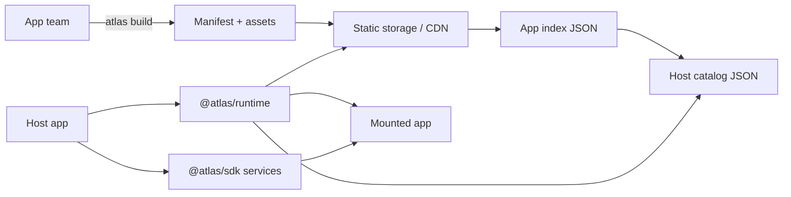

# Atlas Overview

Atlas is a frontend platform for teams that want independently released feature
apps without turning every host release into coordination work.

If independently deployed frontend apps are new to you, think of Atlas as three contracts:

- **Host contract:** one shell application owns the browser page.
- **App contract:** each feature app owns its own UI and release.
- **Deployment contract:** static JSON selects which app versions a host loads.

## Vocabulary

| Word | Meaning | Domain |
| --- | --- | --- |
| Host | The main application users open in the browser. It owns layout, auth, top-level routes, navigation, modals, toasts, monitoring, and shared services. | Host |
| App | A feature application mounted by a host. It owns its framework code, inner routes, feature UI, tests, and assets. | App |
| Widget | A smaller remotely loaded UI exported by an app, such as a popup body, counter, or status panel. | App |
| Manifest | JSON generated for one built host-client or app version. App manifests describe routes, slots, widgets, assets, integrity, framework, and required SDK version. | Deployment |
| Catalog | JSON for one host that selects one manifest version for every app that host can load. | Deployment |
| Registry | Static storage layout that contains app indexes, host catalogs, immutable assets, and historical versions. | Deployment |
| SDK | Typed host capabilities exposed to apps: HTTP, events, navigation, overlays, host data, and product extensions. | Host and App |
| Runtime | Host-side Atlas loader that reads config, resolves catalogs, verifies assets, and mounts apps. | Host |

## Mental Model

The host does not hardcode remote URLs. The app does not decide which version
production uses. Deployment selects versions through catalogs.

## Host Domain

Host teams decide:

- host id and runtime config;
- page layout and Atlas DOM mount anchors;
- top-level routes and navigation surface;
- authentication and HTTP behavior;
- modal, popup, toast, and loading UI implementation;
- monitoring and runtime observability;
- which CDN origins are trusted.

Host teams do not edit app source code to release app features.

## App Domain

App teams decide:

- app id and display name;
- which hosts may load the app;
- route base paths, slots, navigation labels, and widgets;
- framework components, services, hooks, styles, tests, and assets;
- app-internal router structure.

App teams do not own the browser document, global shell layout, or production
version selection.

## Deployment Domain

CI/CD decides:

- `ATLAS_VERSION` and `ATLAS_BUILD_ID`;
- immutable upload location;
- static registry locking or compare-and-swap;
- mutable catalog replacement;
- CDN invalidation or revalidation;
- production verification and rollback.

`atlas build` creates provider-neutral files and publication plan. `atlas
publish` uses explicitly configured storage adapter while preserving locking,
immutable writes, activation order, verification, and restore behavior. Atlas
offers S3-compatible adapter; registry contract does not require S3.

## Learn Next

Continue with [Zero to production](getting-started.md). It is the canonical
sequence for generation, local development, deployment, publication,
verification, and rollback. Use [Architecture](architecture.md), [Static
registry](registry.md), and [Security](security.md) when the tutorial sends you
there or when you need deeper design detail.
