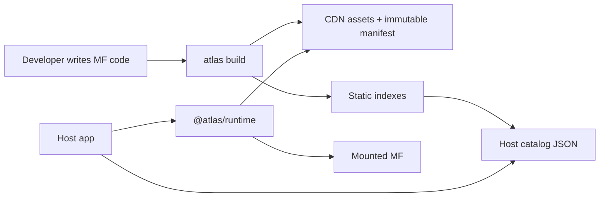

# Atlas Overview

Related guides: [Assets and styles](assets-and-styles.md), [registry](registry.md), [workspaces and monorepos](workspaces.md), and [public API](api.md).

Atlas is a platform for building many small frontend applications that are rendered inside one or more larger host applications.

The main idea is simple:

- A **host** owns the browser page, layout, top-level routing, user session, modals, toasts, and shared product shell.
- A **microfrontend**, or **MF**, owns one feature area.
- A **manifest** is a JSON description of an MF: who it is, where its assets live, what host routes or slots it supports, and which SDK version it needs.
- A **static registry** is a set of JSON indexes and host catalogs stored beside MF assets.
- A **catalog** is the host's resolved list of MF manifests.
- `@atlas/sdk` gives MFs typed access to host communication and navigation.
- `@atlas/runtime` hides loading, version choice, Native Federation, and mounting.

Product developers should not need to understand Native Federation, CDN layout, registry payloads, or override files for normal work. They should generate a host or MF, then write framework code.

## What Atlas Solves

Without a platform, hosts often hardcode remote URLs and every team invents its own loading conventions. That makes host redeploys frequent and local debugging painful.

Atlas moves those decisions into infrastructure:

- hosts contain MF ids or placement rules, not asset URLs
- MFs publish manifests automatically
- CI regenerates the correct static catalog for each host
- the loader enforces one runtime version per MF id
- a Chrome extension can override a single MF to a local, PR, or historical version

## Mental Model



## Focused Packages

MF developers normally use only `@atlas/sdk`. Generated hosts additionally use `@atlas/runtime`, while Atlas CLI manages `@atlas/contracts` and `@atlas/generators` automatically.

Examples:

```ts
import type { AtlasConfig } from "@atlas/contracts";
import { createAtlasSdk } from "@atlas/sdk/host";
import { loadAndMountHostCatalog } from "@atlas/runtime";
```
