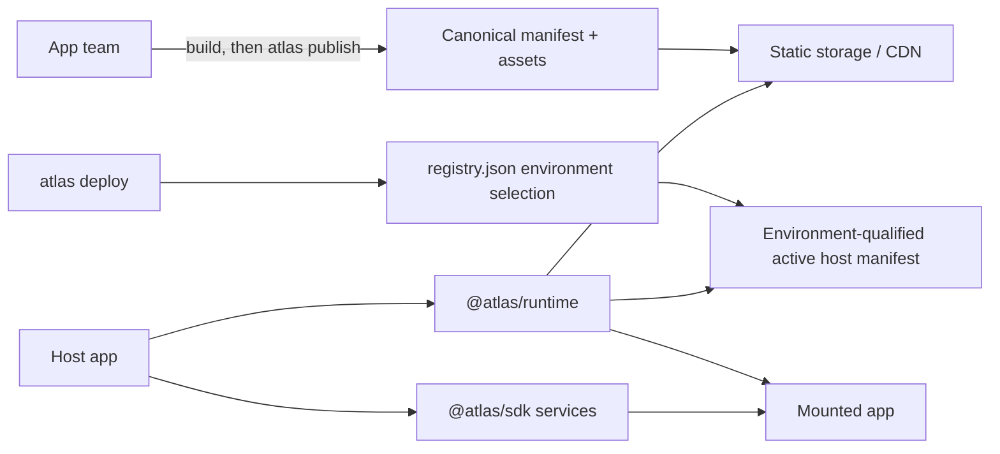

# Atlas Overview

Atlas is a frontend platform for teams that want independently released feature
apps without turning every host release into coordination work.

If independently deployed frontend apps are new to you, think of Atlas as three
parts that work together:

- **Host:** the main application page in the browser.
- **App:** one feature that can be released separately and shown in a Host.
- **Deployment:** configuration that chooses which App versions a Host loads.

## Vocabulary

| Word       | Meaning                                                                                                                                               | Domain       |
| ---------- | ----------------------------------------------------------------------------------------------------------------------------------------------------- | ------------ |
| Host       | The main application users open in the browser. It owns page layout, sign-in, top-level URLs, navigation, shared UI, monitoring, and shared services. | Host         |
| App        | A feature application shown inside a Host. It owns its UI, feature URLs, tests, and assets.                                                           | App          |
| Widget     | A small reusable UI part from an App, such as a popup body, counter, or status panel.                                                                 | App          |
| Manifest   | A JSON file describing one published Host or App version.                                                                                             | Deployment   |
| Deployment | The Host and App versions selected for one environment, such as staging or production.                                                                | Deployment   |
| Registry   | `registry.json`, a file listing available versions and the versions selected for each environment.                                                    | Deployment   |
| SDK        | Typed services that a Host gives Apps: HTTP, events, navigation, Host data, and product extensions.                                                   | Host and App |
| Runtime    | Atlas code in the Host that reads deployment files, checks downloaded files, and shows selected Apps.                                                 | Host         |

## Mental Model

```mermaid
flowchart LR
  AppTeam["App team"] -->|"build, then atlas publish"| Artifact["Canonical manifest + assets"]
  Artifact --> CDN["Static storage / CDN"]
  Deploy["atlas deploy"] --> Registry["registry.json environment selection"]
  Registry --> Active["Environment-qualified active host manifest"]
  Host["Host app"] --> Runtime["@atlas/runtime"]
  Runtime --> Active
  Runtime --> CDN
  Runtime --> Mounted["Mounted app"]
  Host --> SDK["@atlas/sdk services"]
  SDK --> Mounted
```

The Host does not hard-code App URLs. The App does not choose its production
version. Deployment updates `registry.json`, which tells the browser which Host
and App versions to use in each environment.

## What The Host Team Owns

Host teams decide:

- host id and runtime config;
- page layout and Atlas DOM mount anchors;
- top-level routes and navigation surface;
- authentication and HTTP behavior;
- modal, popup, toast, and loading UI implementation;
- monitoring and runtime observability;
- which CDN origins are trusted.

Host teams do not edit app source code to release app features.

## What The App Team Owns

App teams decide:

- app id and display name;
- which hosts may load the app;
- route paths, slots, navigation labels, and widgets;
- framework components, services, hooks, styles, tests, and assets;
- app-internal router structure.

App teams do not own the browser document, global shell layout, or production
version selection.

## What Deployment And CI Own

CI/CD decides storage environment, public registry URL, affected comparison,
bootstrap deployment platform, and verification URLs. Existing release tooling
decides semantic package version.

`atlas build` runs framework build and writes manifest without registry access.
`atlas publish <project> --version <value>` records existing framework output as
one immutable release. `atlas deploy <artifact> --to <environment> --version
<selector>` selects already-published bytes, updates `registry.json`, and
converges affected active host manifests. Built-in storage supports S3-compatible
providers through standard AWS SDK credentials; registry contract remains
provider-neutral.

## Learn Next

Continue with [Get Started](getting-started.md) to install Atlas and create your
first host and app. Then choose [Atlas Host](host.md) or [Atlas App](app.md) for
role-specific journey. Use [Architecture](architecture.md), [Static registry](registry.md),
and [Security](security.md) when you need deeper design detail.
