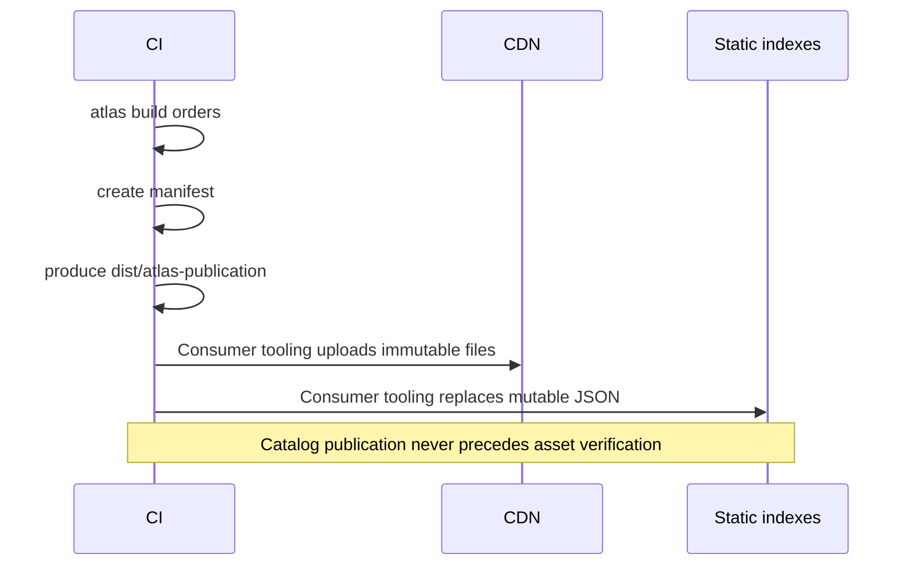

# Production Deployment

This guide describes the Angular production path from source code to a remote mounted by a host.

## Runtime Configuration

An Angular host serves generated `public/atlas.runtime.json` as a static file:

```json
{
  "schemaVersion": "1",
  "hostId": "customer-shell",
  "catalogUrl": "https://cdn.example.com/atlas/hosts/customer-shell/catalog.json",
  "allowAppOverrides": true,
  "resourcesTimeoutMs": 15000,
  "resourcesRetryCount": 3
}
```

Atlas loads the exact asset URLs selected by the host catalog. See [Security](security.md).

Generate it from the host's `atlas.config.ts`:

```sh
atlas runtime-config customer-shell --registry-base-url=https://cdn.example.com/atlas
```

The file is outside the compiled JavaScript bundle. Deployment tooling can
replace it per environment without rebuilding the host. It contains no MF URLs;
the static catalog resolves MF ids to one version each. See [Static Registry](registry.md).

## Build And Upload Flow



Build provider-neutral deployment files:

```sh
ATLAS_VERSION=1.4.0 \
ATLAS_BUILD_ID="$BUILD_ID" \
ATLAS_REGISTRY_BASE_URL=https://cdn.example.com/atlas \
atlas build orders
```

Non-local builds require `ATLAS_REGISTRY_BASE_URL` or
`--registry-base-url`; Atlas never falls back to localhost for production, PR,
or historical manifests.

Then use any consumer-owned deployment mechanism:

```sh
rsync -a dist/atlas-publication/ /srv/cdn/atlas/
aws s3 sync dist/atlas-publication/ s3://product-atlas/
jf rt upload "dist/atlas-publication/(*)" "product-atlas/{1}"
```

Atlas performs no storage writes and requires no storage credentials. `dist/atlas-publication.json` tells CI which files are immutable and which require revalidation. CI owns authentication, retries, atomic replacement, locking, and cache invalidation.
Source maps are excluded from publication by default. Pass
`--include-source-maps` only after reviewing production access and retention.
Excluded source maps also do not contribute to the derived build id.

### Required CI order

Treat the publication plan as an ordered transaction:

1. Acquire the registry deployment lock, or begin a provider-specific compare-and-swap operation.
2. Confirm that the live `registry.json` revision equals `baseRevision`.
3. Upload every file marked `immutable`. Never overwrite an existing immutable path.
4. Confirm that the new immutable URLs are publicly readable.
5. Replace files marked `revalidate`, using atomic rename or the storage provider's atomic object replacement.
6. Purge or revalidate mutable CDN paths.
7. Run `atlas verify` against the public host runtime URL.
8. Release the deployment lock.

If any step before mutable replacement fails, leave the existing catalogs in
place. The unused immutable files are harmless and can be retained. If public
verification fails after replacement, run the rollback procedure below using
the last known-good version.

## Verify A Deployment

After uploading, verify the same public files a browser will consume:

```sh
atlas verify \
  --runtime-url=https://customer.example/atlas.runtime.json
```

For a runtime file hosted somewhere other than the application origin, provide
the real host origin used by browser CORS checks:

```sh
atlas verify \
  --runtime-url=https://config.example/customer/atlas.runtime.json \
  --host-origin=https://customer.example
```

The command validates runtime and catalog JSON, one selected version per MF,
manifest contracts, routes, exported component references, remote expose files,
asset availability,
SHA-256 integrity, MIME types, CORS, and cache policy. Failures produce a
non-zero exit code for CI. Missing recommended immutable cache headers are
warnings; broken browser loading or trust requirements are failures.

Verification is read-only. It neither executes remote code nor needs storage
credentials, so it works the same way with Nginx, S3, Artifactory, and other
HTTP-accessible storage.

For reproducible output, set `ATLAS_CREATED_AT` to the CI build timestamp or provide the standard `SOURCE_DATE_EPOCH`. When `ATLAS_BUILD_ID` is omitted, Atlas derives a stable build id from the compiled artifact content.

For concurrent pipelines, keep the registry lock from snapshot download through mutable-file replacement. Alternatively, compare the live registry revision against the publication plan's `baseRevision` immediately before an atomic replacement. A mismatch means the pipeline must fetch the latest snapshot and rebuild. See [Concurrent CI Builds](registry.md#concurrent-ci-builds).

## CDN Requirements

- Serve `remoteEntry.json` as `application/json`.
- Serve JavaScript modules as `text/javascript` or `application/javascript`.
- Enable CORS for every host origin, including `GET` and `HEAD`.
- Preserve immutable version/build paths while versions remain browsable.
- Do not rewrite missing JavaScript or JSON assets to the host's `index.html`.
- Keep `remoteEntry.json` and referenced chunks under the same immutable prefix.
- Revalidate or invalidate `registry.json`, MF indexes, and host catalogs after publication.
- Serialize mutable publication or use a provider-side compare-and-swap for jobs sharing one static registry root.

## Host Requirements

- Return the host `index.html` for deep links such as `/orders/42`.
- Serve `atlas.runtime.json` with a short cache lifetime or deployment invalidation.
- Apply a Content Security Policy that permits approved CDN origins.
- Provide real toast, modal, user, and configuration implementations through `startHost`.

## What Happens At Runtime

1. Native Federation initializes the host import map.
2. Atlas reads `atlas.runtime.json` and the host catalog.
3. Atlas applies an optional local, PR, or historical override.
4. Atlas enforces one selected version per MF id.
5. Atlas fetches and verifies SHA-256 integrity for production remote entries.
6. The host Router synchronizes with a deep-linked browser URL.
7. Atlas mounts the matching route and declared slots.
8. Navigation unmounts the previous route before mounting its replacement.

## Rollback

Assets are immutable, so rollback selects an already published production
manifest and replaces only mutable registry and host catalog JSON. It does not
rebuild the MF, re-upload chunks, or redeploy the host.

```sh
atlas rollback orders \
  --version=1.3.2 \
  --registry-base-url=https://cdn.example.com/atlas
```

If the same version has multiple builds, identify the exact immutable build:

```sh
atlas rollback orders --version=1.3.2 --build-id=1.3.2-a81f29c204e1
```

Atlas reads the current `registry.json` and writes `dist/atlas-rollback` plus
`dist/atlas-rollback.json`. Consumer CI uploads the listed `revalidate` files
using the same lock or revision comparison used for releases. CI may instead
pass `--registry-snapshot` and `--expected-registry-revision`.
Rollback always requires `--registry-base-url` or `ATLAS_REGISTRY_BASE_URL`,
including when a local registry snapshot is supplied.

The registry preserves every release and records the selected production build
per MF. A normal production build automatically selects its new build. Rolling
forward uses the same rollback command with a newer version.

After upload, invalidate or revalidate `registry.json` and host catalogs.
Existing browser sessions keep loaded code until reload; new loads use the
restored catalog without a host deployment.

### Production rollback drill

Before the first production release, verify this procedure in a staging
environment backed by the same storage and CDN products used in production:

1. Deploy two visibly different versions of one MF.
2. Confirm the unchanged host loads the newer immutable URL.
3. Generate a rollback to the older version.
4. Replace only the rollback plan's mutable files and invalidate them.
5. Reload the unchanged host and confirm it loads the older immutable URL.
6. Roll forward to the newer version using the same command.

Atlas runs this scenario in its browser E2E suite with CDN-style cache headers
and atomic mutable-file replacement. Consumer staging remains necessary because
locking, credentials, object replacement, and invalidation APIs belong to the
chosen storage provider.
